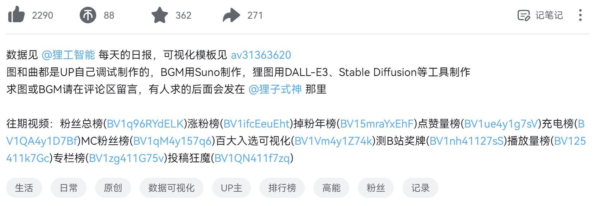
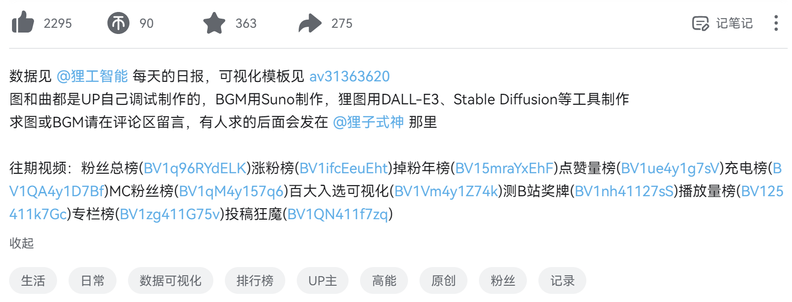
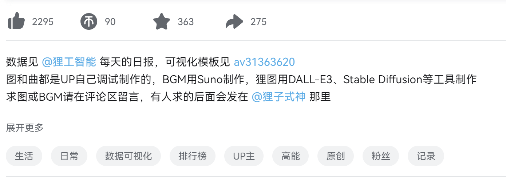

# BiliDescToggle 📝

> B站视频简介显示控制工具 | Video Description Toggle Tool for Bilibili

---

## 🚀 核心功能

### 📝 简介显示优化
- 默认完整显示视频简介内容
- 双击A键快速切换简介显示/隐藏

---

## ⌨️ 功能对照表
| 功能描述 | 状态 |
|---------|------|
| 默认展开简介 | ✅ 已实现 |
| 双击切换显示 | ✅ 已实现 |

---

## 📥 安装指南

1. **必备环境**  
   需先安装 [油猴插件][tm]（Tampermonkey）

2. **一键安装脚本**  
   [点击安装][install]

---

## 📸 效果展示

### 修改后效果

### 修改前效果

> 双击A键可以快速切换简介的显示状态

---

## 🔄 更新日志

### v0.1
- 初始版本发布
- 实现默认展开简介功能
- 实现双击A键切换显示/隐藏功能

---

## 💡 问题反馈
欢迎提交问题至 [Issues区][issues]

---

<!-- 隐式链接定义 -->
[tm]: https://www.tampermonkey.net/
[install]: https://github.com/uncharity/BiliDesc-Toggle/raw/main/main.user.js
[issues]: https://github.com/uncharity/BiliDesc-Toggle/issues
